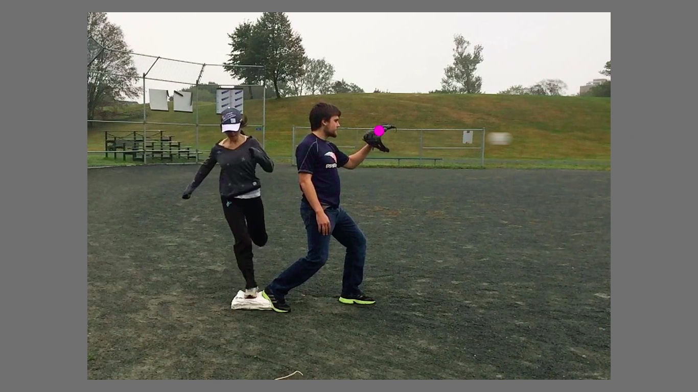

# BaseballTOJ

BaseballTOJ is an experiment program for a study ([Redden, d'Entremont, & Klein, 2017a](http://dx.doi.org/10.1037/cep0000118)) that explored whether endogenous (i.e. self-directed) spatial attention to either the base or glove in baseball can affect people's jugdements of whether a runner is "safe" or "out". 



On most trials of this experiment, participants are asked to judge whether the runner in the video clip was "safe" or "out". On the rest of the trials, a colour dot will appear at either the glove or base location, and participants are asked to indicate what colour they saw on a colour wheel. For half the blocks, participants are informed that the colour dot will appear more often at the glove than the base, and are told the opposite on the other half of blocks.

**NOTE**: This experiment program has been modified from the version used in [Redden et al., 2017a](http://dx.doi.org/10.1037/cep0000118)). It has been updated to run properly with modern versions of KLibs, take up significantly less disk space, and ask participants for their gender instead of their sex during demographics collection. If you intend to replicate this experiment, we highly recommend you use this branch to do so. However, you can still examine the original code in the [master](https://github.com/TheKleinLab/BaseballTOJ/tree/master) branch. Additionally, if you want to experience the experiment as close to as it was originally, with the minimum amount of changes required to run in modern KLibs, you can check out the [updated](https://github.com/TheKleinLab/BaseballTOJ/tree/updated) branch here.

## Requirements

BaseballTOJ is programmed in Python 2.7 (3.3+ compatible) using the [KLibs framework](https://github.com/a-hurst/klibs). It has been developed and tested on macOS (10.9 through 10.13), but should also work with minimal hassle on computers running [Ubuntu](https://www.ubuntu.com/download/desktop) or [Debian](https://www.debian.org/distrib/) Linux, as well as on computers running Windows 7 or newer with [a bit more effort](https://github.com/a-hurst/klibs/wiki/Installation-on-Windows).

## Getting Started

### Installation

First, you will need to install the KLibs framework by following the instructions [here](https://github.com/a-hurst/klibs).

Then, you can then download and install the experiment program with the following commands (replacing `~/Downloads` with the path to the folder where you would like to put the program folder):

```bash
cd ~/Downloads
git clone --depth 1 https://github.com/TheKleinLab/BaseballTOJ.git
```

You will also need to install the [imageio](https://imageio.github.io) module and its ffmpeg component, which you can do by running:

```
pip install imageio imageio-ffmpeg
```

If using default system Python on macOS, you will need to preface the above command with `sudo -H ` for it to work.

### Running the Experiment

BaseballTOJ is a KLibs experiment, meaning that it is run using the `klibs` command at the terminal (running the 'experiment.py' file using Python directly will not work).

To run the experiment, navigate to the BaseballTOJ folder in Terminal and run `klibs run [screensize]`,
replacing `[screensize]` with the diagonal size of your display in inches (e.g. `klibs run 24` for a 24-inch monitor). If you just want to test the program out for yourself and skip demographics collection, you can add the `-d` flag to the end of the command to launch the experiment in development mode.

#### Optional Settings

The experiment program allows you to specify which probe location (glove or base) attention should be biased towards first. To set the first probe bias, you can open the experiment's parameters file (`ExpAssets/Config/BaseballTOJ_params.py`) and set the value of the variable `first_bias` to either "glove" or "base". By default, the first block's probe bias is to the glove location.
 

### Exporting Data

To export data from BaseballTOJ, simply run 

```
klibs export -join surveys
```

while in the BaseballTOJ directory. This will export the trial data for each participant into individual tab-separated text files in the project's `ExpAssets/Data` subfolder.
